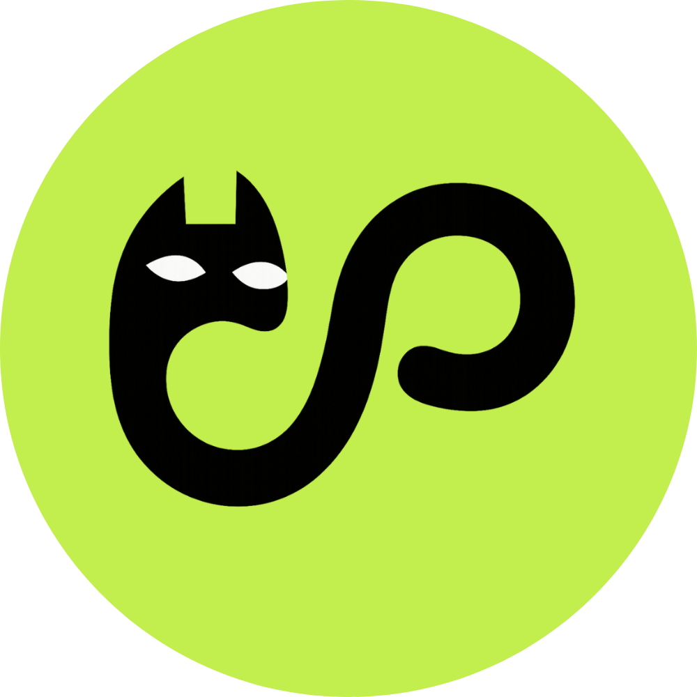
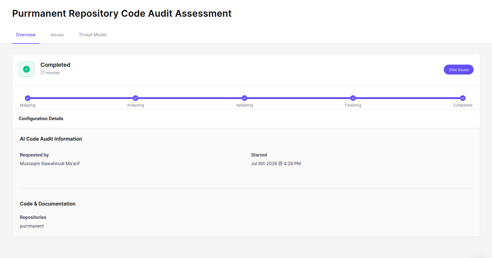
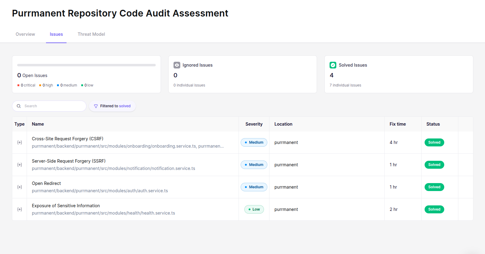

<p align="center">
  
</p>

<h1 align="center">Purrmanent</h1>

<p align="center">
  A 90-day interactive guide for new cat parents — track health, manage daily checklists, get AI coaching, and earn graduation certificates.
</p>

---

## Overview

Purrmanent helps new cat parents navigate the critical 90-day adjustment period after adoption, based on the 3-3-3 rule (3 days, 3 weeks, 3 months). The app provides structured daily checklists, health tracking, an AI coach, crisis guidance, and gamification to keep adopters engaged.

- [Frontend Documentation](src/frontend/README.md)
- [Backend Documentation](src/backend/README.md)

---

## Security Audit

All issues from the Aikido code audit have been successfully resolved.

<p align="center">
  
</p>

<p align="center">
  
</p>

---

## Quick Start (Docker)

**Prerequisites:** [Docker](https://docs.docker.com/get-docker/) and [Docker Compose](https://docs.docker.com/compose/install/)

```bash
# Clone the repository
git clone https://github.com/mcqeems/purrmanent.git
cd purrmanent

# Create your env file from the example
cp .env.example .env
# Edit .env — fill in your env vars
# At minimum: SERVICE_PASSWORD_POSTGRES, SERVICE_BASE64_AUTHSECRET, LLM_API_KEY

# Create frontend env file
cp src/frontend/.env.example src/frontend/.env.production
# Edit src/frontend/.env.production with your domain/Supabase credentials

# Start all services
docker compose up --build
```

- **Frontend:** http://localhost:3000
- **Backend API:** http://localhost:3001
- **PostgreSQL:** localhost:5433

The backend automatically runs migrations, seeds demo data, and ingests the RAG corpus on first start.

### Environment Variables

Copy `.env.example` to `.env` and configure. Only `SERVICE_PASSWORD_POSTGRES` and `SERVICE_BASE64_AUTHSECRET` are strictly required to boot. External-service keys are optional — the feature that needs a missing key fails at call-time with a clear error, not at boot.

The frontend requires its own `.env.production` file (copy from `src/frontend/.env.example`). If you encounter env variable conflicts or mismatches between Docker and the frontend, uncomment the frontend variables at the bottom of the root `.env.example` and configure them there.

---

## Manual Installation

For manual setup without Docker, see the individual README files:

- **Frontend:** [src/frontend/README.md](src/frontend/README.md)
- **Backend:** [src/backend/README.md](src/backend/README.md)

---

## Tech Stack

| Layer | Technology |
|-------|-----------|
| Frontend | Next.js 16, React 19, TypeScript 5, Tailwind CSS v4, shadcn/ui |
| Backend | NestJS 11, TypeORM, Zod, better-auth |
| Database | PostgreSQL 16 with pgvector extension |
| AI | LLM via Bynara (OpenAI-compatible), local embeddings (all-MiniLM-L6-v2) |
| Auth | better-auth (email/password + Google OAuth) |
| Package managers | Bun (frontend), pnpm (backend) |

---

## Project Structure

```
purrmanent/
├── src/
│   ├── frontend/          # Next.js frontend
│   │   ├── app/           # Route pages + layouts
│   │   ├── features/      # Domain modules (auth, cats, coach, etc.)
│   │   ├── components/    # UI primitives (shadcn)
│   │   └── lib/           # Utilities, API client, validation
│   └── backend/           # NestJS backend
│       ├── src/
│       │   ├── modules/   # Feature modules (auth, cats, coach, etc.)
│       │   ├── common/    # Shared services (LLM, embeddings, events)
│       │   ├── database/  # DataSource, migrations, corpus repository
│       │   └── entities/  # TypeORM entities
│       └── data/          # RAG corpus + crisis protocols
├── documentation/         # Screenshots and docs
├── docker-compose.yml     # Docker setup
└── README.md              # This file
```

---
